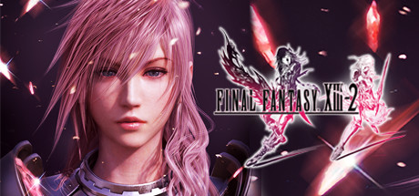

# FINAL FANTASY XIII-2

# Table of Contents
- [FINAL FANTASY XIII-2](#final-fantasy-xiii-2)
- [Table of Contents](#table-of-contents)
- [Introduction](#introduction)
  - [Steam](#steam)
  - [Fandom](#fandom)
- [USP - Unique Selling Points](#usp---unique-selling-points)
- [Game Features / Mechanics](#game-features--mechanics)
- [Gui](#gui)
- [Gameplay Gif](#gameplay-gif)
- [Other](#other)
  - [Core Identity](#core-identity)
  - [Style Aesthestic](#style-aesthestic)
  - [Game Genre](#game-genre)
  - [Biased Game Genre](#biased-game-genre)
- [Critism](#critism)
  - [Journalist](#journalist)
  - [User](#user)
  - [Overview](#overview)
- [Conclusion](#conclusion)
- [References](#references)

# Introduction
## Steam
Now enhanced for Windows PC, FINAL FANTASY XIII-2 is created with the aim of surpassing the quality of its predecessor in every way, featuring new gameplay systems and cutting-edge visuals and audio. In this game the player has the freedom to choose from a range of possibilities and paths; where their choices affect not only the immediate environment, but even shape time and space!
It is no longer about facing destiny. Create a new future and change the world!

Now Enhanced for Windows PC
Including a range of the downloadable content from the original console, plus the choice for either English or Japanese voiceovers, 60 frames-per-second graphics and customizeable rendering resolution (720p, 1080p, and more).

Larger, More Interactive Environments
Places with multiple pathways to explore, and many secrets to find, offer players the chance to shape the adventure their way.

Time Travel - A New Dimension of Exploration
The situation, scenery, flora, fauna and weather conditions all change, depending on when you visit locations. Untangling the threads of time is essential in witnessing the full story!

Enhanced Battle System
New elements such as visually dynamic Cinematic Action sequences, and an innovative battle clock that will either reward or punish players, create further variety and choice for the player.

Master of Monsters
A wide variety of over 150 different monsters inhabiting the game world can be recruited into the player’s party and battle strategy, with each creature having unique and devastating special abilities!

## Fandom

# USP - Unique Selling Points
- Linear Storyline
- RPG

# Game Features / Mechanics
- Single Player Story Based (Chapter-based progression)
- Battle System
  - Emotions
  - Friendly Follow-Up
  - Items
  - Quests
- Enemies
- Locations

# Gui

# Gameplay Gif

# Other
## Core Identity
- A single player RPG adventure game

## Style Aesthestic
- Stylize
- Fantasy, Pixel Art

## Game Genre
- RPG

## Biased Game Genre
- RPG, RPG Maker style Game

# Critism
## Journalist
## User

## Overview

Cons:
- The base PC port is a mess

# Conclusion
The game is good and bad.

Score 
- Meta Score: 83 / 100
- User Score: 6.1 / 10

# References
- Steam
- Wikipedia
- Critics
- Steam Critics

- https://store.steampowered.com/app/292140/FINAL_FANTASY_XIII2/