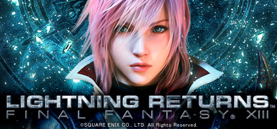

# LIGHTNING RETURNS: FINAL FANTASY XIII

# Table of Contents
- [LIGHTNING RETURNS: FINAL FANTASY XIII](#lightning-returns-final-fantasy-xiii)
- [Table of Contents](#table-of-contents)
- [Introduction](#introduction)
  - [Steam](#steam)
  - [Fandom](#fandom)
- [USP - Unique Selling Points](#usp---unique-selling-points)
- [Game Features / Mechanics](#game-features--mechanics)
- [Gui](#gui)
- [Gameplay Gif](#gameplay-gif)
- [Other](#other)
  - [Core Identity](#core-identity)
  - [Style Aesthestic](#style-aesthestic)
  - [Game Genre](#game-genre)
  - [Biased Game Genre](#biased-game-genre)
- [Critism](#critism)
  - [Journalist](#journalist)
  - [User](#user)
  - [Overview](#overview)
- [References](#references)

# Introduction
## Steam
Lightning Returns is the concluding chapter of the Final Fantasy XIII saga and series heroine Lightning's final battle. The grand finale of the trilogy brings a world reborn as well as free character customization and stunning action based battles.

The world is sinking into a sea of chaos, and in thirteen days, nothing will remain.
Though the planet is doomed, there is still hope for those who call it home.
After centuries in crystal stasis, a hero has awoken—a legendary warrior on a god-given mission to save the souls of mankind. Her name: Lightning.
Blessed with incredible strength and an arsenal of new weapons, she has everything she needs for the coming battle. Everything except time. And now she must make an impossible choice...

LIGHTNING UNDER YOUR CONTROL
Lightning will be the playable character - with a highly evolved range of techniques for battles and exploring the environment. Customise Lightning with a large range of different outfits and weapons; that affect not only the way she looks, but also her actions and abilities.

ACTION-ORIENTED COMBAT
A new battle system gives a level of direct control over the action unlike any FINAL FANTASY game, while having iconic elements that are known and loved throughout the series too.

DLC CONTENT FROM THE ORIGINAL CONSOLE VERSION
The PC release will also include all the amazing DLC content from the original console version*, including Japanese voice-overs and various costumes, shields and weapons.
*Except for “FFVII Aerith Costume”

A CONSTANTLY MOVING, BEAUTIFUL WORLD
Stunning artistic direction depicts a doomed world filled with choice and diversity. Living, expansive environments featuring a rising and setting sun provide unique experiences for every player.

USE YOUR TIME WELL
A world on a course for total annihilation presents unique challenges; where certain areas, missions, and people will only be available during selected periods. How will you use your remaining time?

A CONNECTED EXPERIENCE
Stay connected to FINAL FANTASY and its characters, with unique features that link the in-game world to the real world.

Notes:
This version of the game has had no changes or additions made to the story of the original LIGHTNING RETURNS FINAL FANTASY XIII.
Supports Dolby® Digital output compatible sound cards.
This version of the game includes some of the downloadable content released for the original.
The bonus items originally awarded for having save data from previous games in the series will be awarded in this version regardless of whether there is suitable save data present or not.
Includes no functionality linked to Square Enix Members or social networking sites.
It is not possible to change the names assigned to chocobos, map markers or schemata.

Key functionality features of LR:FFXIII
Supports graphics options intended for high-end PCs:
- Rendering resolution
- Scaling of the display area
- Shadow processing
- Texture filters
- Colour correction
- Depth of field
- Lighting
- Glare
Supports full screen and windowed display modes
Supports a maximum frame rate of 60fps
Supports Full HD display with a maximum resolution of 3840x2160

## Fandom

# USP - Unique Selling Points
- Linear Storyline
- RPG

# Game Features / Mechanics
- Single Player Story Based (Chapter-based progression)

# Gui

# Gameplay Gif

# Other
## Core Identity
- A single player RPG adventure game

## Style Aesthestic
- Stylize
- Fantasy, Pixel Art

## Game Genre
- RPG

## Biased Game Genre
- RPG, RPG Maker style Game

# Critism
## Journalist
## User

## Overview

Cons:
- The base PC port is a mess

# References
- Steam
- Wikipedia
- Critics
- Steam Critics

- https://store.steampowered.com/app/292140/FINAL_FANTASY_XIII2/