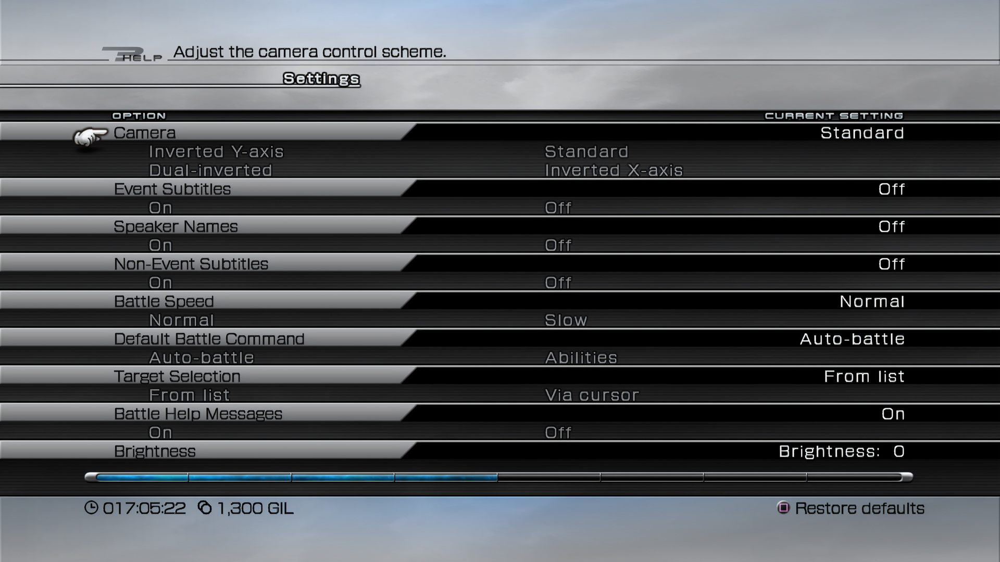

# FINAL FANTASY XIII

# Table of Contents
- [FINAL FANTASY XIII](#final-fantasy-xiii)
- [Table of Contents](#table-of-contents)
- [Introduction](#introduction)
  - [Steam](#steam)
  - [Fandom](#fandom)
- [USP - Unique Selling Points](#usp---unique-selling-points)
- [Game Features / Mechanics](#game-features--mechanics)
- [Gui](#gui)
- [Gameplay Gif](#gameplay-gif)
- [Other](#other)
  - [Core Identity](#core-identity)
  - [Style Aesthestic](#style-aesthestic)
  - [Game Genre](#game-genre)
  - [Biased Game Genre](#biased-game-genre)
  - [Story](#story)
- [Critism](#critism)
  - [Journalist](#journalist)
  - [User](#user)
    - [themaestro13](#themaestro13)
    - [Shortchimp](#shortchimp)
    - [Gorast](#gorast)
  - [Overview](#overview)
- [Conclusion](#conclusion)
- [References](#references)

# Introduction

## Steam
Final Fantasy XIII is a fantasy RPG in which a band of brave humans struggle against fate in the utopian sky city of Cocoon and the primeval world of Pulse. Follow stylish heroine Lightning's fast paced battles and high adventure in a mysterious new world.

DO YOU HAVE THE COURAGE TO FACE YOUR DESTINY?

As a deepening crisis threatens to plunge the floating world of Cocoon into chaos, a band of unsuspecting strangers find themselves branded enemies of the state. With the panicking population baying for their blood, and the military all too happy to oblige, they have no choice but to run for their lives. Join them on a desperate quest to challenge the forces controlling their fate, and prevent untold destruction.

Featuring an unforgettable storyline, a battle system blending action and strategy, cutting-edge visuals and awe-inspiring cinematic sequences, FINAL FANTASY® XIII delivers the next step in the evolution of gaming.

Final Fantasy XIII has been optimised for PC, featuring full screen support and running at 60FPS.
Both English and Japanese voice over will be available.

## Fandom
Final Fantasy XIII is the thirteenth main installment in the Final Fantasy series and the flagship title of the Fabula Nova Crystallis: Final Fantasy sub-series, developed and published by Square Enix. It was released in December 2009 for the PlayStation 3 and Xbox 360, and has since been re-released on Microsoft Windows in 2014. It was directed by Motomu Toriyama, with Tetsuya Nomura designing the main characters and Masashi Hamauzu composing the score. The game runs on the Crystal Tools engine. It was the first multi-platform Final Fantasy title and the first to be translated into traditional Chinese.

Final Fantasy XIII is set on the world of Gran Pulse, above which floats Cocoon, an artificial biodome on which humanity lives, fearful of the surface world. Lightning, a member of the Guardian Corps military forces, goes rogue when her sister Serah is branded a l'Cie by a fal'Cie from Gran Pulse, designating her an enemy of Cocoon. The Sanctum government authorizes a Purge of citizens who may have come in contact with the fal'Cie, and Lightning meets up with the pilot Sazh Katzroy on her way to find Serah amid the Purge. Also caught up in the Purge are Snow Villiers, Serah's fiance and leader of the anti-authority group, NORA, and the civilians Hope Estheim and Oerba Dia Vanille. The five come into contact with the Pulse fal'Cie, Anima, and are branded l'Cie, seemingly with the Focus to destroy Cocoon.

The gameplay makes use of the Command Synergy Battle system, a more fast-paced menu-based combat system that derives from the Active Time Battle system. The player controls the party leader and chains as many actions as there are ATB gauges, with different actions consuming different amounts of ATB. The party's abilities and actions are determined by the current paradigm, with combat requiring the player to shift between paradigms and to level the paradigm roles via the Crystarium system. The game's first half is linear, while the latter half opens up once the party reaches Gran Pulse.

Final Fantasy XIII received generally positive reviews from most outlets, who praised the graphical presentation and battle system, while the story received a mixed reaction and criticized the linearity.[3] Final Fantasy XIII was commercially successful, with Square Enix announcing it sold approximately 6.6 million copies.[4] A sequel titled Final Fantasy XIII-2 was released in 2011, and a second sequel, Lightning Returns: Final Fantasy XIII, was released in 2014. Square Enix announced that the Lightning Saga had sold 11 million copies worldwide.[5]

# USP - Unique Selling Points
- Linear Storyline
- Unforgettable Storyline
- A battle system blending action and strategy
- Cutting-edge visuals and awe-inspiring cinematic sequences
- Open world based on story narative

# Game Features / Mechanics
- Single Player Story Based (Chapter-based progression)
- Command Synergy Battle (CSB)
- Active Time Battle (ATB)
- Paradigm Shift
- Crystarium
- Equipment
- Summoning
- Missions

# Gui

# Gameplay Gif

# Other
## Core Identity
- A single player RPG adventure game

## Style Aesthestic
- Anime Stylize
- 3D
- Fantasy, Sci-fi

## Game Genre
- RPG (abandon JRPG)

## Biased Game Genre
- JRPG, RPG

## Story
- Flcie

# Critism
## Journalist

## User
### themaestro13
What makes it unique to the series?
It’s the worst one. It was ill-conceived at every step of the way. I would not play this unless you’re looking to complete the series, there’s very little to recommend here.

Positives
- I liked the main song the first couple hundred times I heard it. Unfortunately, this only accounted for like the first 2 hours of the game. By hour 20, you will mute your TV and listen to anything else.

- Once it opens up and you get what they’re going for, the combat isn’t that bad. It’s like a semi-automatic system where you’re giving people general orders about what to do rather than dictating every step in the process. There’s two problems with that though. First, it takes about 20 hours before you’re really about to change much of anything, with different parts of combat slowly unlocking along the way. Second, sometimes you really want that discrete control so an attack does wipe out your main character and immediately end the game. I’ve never actually finished this game (watched the ending on YouTube) because the final boss has an instant death attack and even when following a walkthrough I couldn’t consistently avoid it. Absolutely maddening.

Negatives
- Some of the dumbest, most insufferable characters in all of gaming. Here are some lines you’re going to hear constantly throughout:
“I can’t forgive him, he killed my mom.”
“We have to complete our focus.”
“Blah blah I’m a hero blah blah.”

These people go on and on repeating the same crap for basically the entire game. They make decisions that are so blindingly ignorant of what’s in front of their eyes that it’s more believable that they all got massive brain injuries in the opening train crash. I’m sure some of this is intentional, but it’s like the writer is 13 and just learned what character development is. Nobody would have liked Jaime Lannister if he just spent 5 seasons going “But they took muh hand!” – characters can talk about different things and still show growth.

- You’ve probably heard that this game is very linear and from the defenders that it “get better later.” Let me tell you what that last part means. Around the last 20% of the game, you can run around a big open field with nothing to do but fight big monsters and take boring side quests from glowing orbs. No big cities to explore, no side quests with memorable characters and fun moments, no secrets waiting to be uncovered in the environment. Assassin’s Creed has more interesting quests and environments and it routinely gets raked over the coals for them. There is nothing worth experiencing at the end of this game.

- Some very confusing storytelling. A lot of the lore here is hidden away in the in-game encyclopedia and I wouldn’t mind this if it wasn’t critical to understanding some moments in the game. Hell, I read it all and I still didn’t understand the ending. It seems to blatantly go against everything the game tells you possible. Final Fantasy stories were often ridiculous (this is a series where amnesia is as predictable as chocobos) but they usually made sense and stuck to their own logic. Most modern entries don’t care, though. They just go with whatever feels like the most emotional outcome and justify it later. I just don’t get why they think this is effective storytelling.

### Shortchimp 

6.5/10
Final Fantasy XIII is a pretty infamous FF game, as apart from of course FF2, FF13 is pretty hated FF entry by the community. Now that I have finally played this entry... I get their complaints... and I agree with some aspects of it.... but at the same time I disagree with some points that are brought up in discussion.

Story
To be quite honest, I am split on this story, as for some aspects of it I really did love. It has themes of fates and family all tied around, while having a simple goal in the beginning, save cocoon. While the story is easily character focused, it still had me interested enough to continue on this game. However it has a ton of issues that stand out. I don't think the story was well put together, pacing and just structure wise. Many points in this game just has the character blurt out these obvious "deep lines" where they monologue about something heavy out of nowhere, and while sometimes they did land, a ton of times they just stood out like a sore thumb. It doesn't help as well that the story in the very beginning is VERY complex/ convoluted, which I did like tbh. I know people complain that you NEED to read the datalogs to understand everything, and while I didn't fully explore them, a ton of details were given to you once during the story and as long as you were paying attention, you got what was their motivations, and if I forgot a detail, usually whenever you enter a new save or area it recaps the lore to you anyways. I think this story had a TON of potential, but just didn't land at specific points like how in the early game, its dumped on you while also having pretty unlikable characters (but ay, here is a ton of flashbacks to see they are all connected!), mid way point was good, but around late game it starts to have terrible pacing and slows down tremendously. Conclusion was bittersweet and I actually liked it, but MAN did the story just not land as much as I hoped it would.

Characters
This was easily the main focus of FF13, while the story was convoluted mainly, breaking the plot down, its honestly a pretty simple story of l'cie good and fal'cie bad (even if that is oversimplified). The characters however was what got the most development across the game, and for a bit I liked them... and hated some other arcs. I think overall Lightning's arc was pretty enjoyable, although wasn't my favorite character arc, which goes to Fang and Vanille's arc which easily went through the most development from the whole cast. I think Sazh was undercooked towards the mid way point after a certain plot point occurs for him, which I feel like can be blamed towards kinda resolving his arc too quickly, and he just stands around for the rest of the game till the VERY end. My least favorite arc was easily snow and hope's arc, cause good LORD was it annoying asf to watch their entire struggle be just cause of miscommunication. Literally, ANYONE ELSE could had just told snow the truth about hope but NOPE, lets just harm him so "Hope can develop his own character by himself!". It was just too annoying to watch. Most of the character's have bumps early game, but do start to become more likeable as they learn from their flaws and avoidable mistakes. Most of the good moments of this game revolves around them, and while I don't think it was perfect, it was pretty good, and what made the story also enjoyable.

Gameplay
Here is easily the biggest complaint of FF13... the awful gameplay... kinda? I think most of the complaints I hear about 13 combat is people who played a bit then quit, cause the combat early game compared to late game combat might as well be a whole different game. That however is easily the biggest issue of ff13, is that for NINE chapters out of THIRTEEN, the gameplay is WAYYYY too slowly introduced to you, and is easily the worst aspect about 13. For basically a huge portion of the game, you have like 2 attacks, mainly 2 party members that the game decides to give to you, and tells you to mash. A TON of the mechanics in the game is slowly dripped to you, and you aren't even allowed to choose your own team till the 9th chapter, which is WAY too long, cause once you do get past that, while also having to deal with the awful hallway level design till chapter 11, its easy to see why some people just never reached the end of 13. Once you do get past that huge gap and the game FINALLY allows you to explore on your own for the paradigm system, its honestly pretty good, but not perfect. This is probably the hardest FF game I've played singleplayer wise for the normal msq, as the game after awhile actually punishes you for reusing the same strat over and over, and I am GLAD about that. However, there are flaws that linger on still. For one, there is a TON of pauses in everything you do, the character turning, the paradigm shifting first time taking years, and even after that taking a bit too long, annoying enemy types that force lame playstyles, especially ones that are not only tanky, but are immune to status afflictions (luckily most bosses still allow debuff, it was mainly high hp enemies that did this). The paradigm system works the best when fighting enemies that require multiple strategies and pre-planning with the team, and falls when fighting enemies that require one hyperspecific strategy, or just early game where you barely have anything to work with at all.

Music
Again, Final Fantasy music hits again, and this time it was mainly about how beautiful the ost was in this game. While there weren't that many hype songs, there were a ton of tear jerking songs and a ton of just beautiful songs in general. The battle theme as well just hits, with that one violin part is just chefs kiss.

PC Port
I only complain about ports whenever I review when they REALLY stick out, and ff13's pc port was easily pretty horrible. Terrible remapping, terrible fmv audio quality without modding, annoying bug where if you don't plug in a controller at start, the game stutters like crazy every 1 second to check for a controller, crashes for anything (even just screenshotting randomly crashes), and even with the ff13fix mod, it STILL crashed. Its playable, but oh my god I would jump just TRYING to screenshot, cause if it crashes then its back to an older save cause there is no auto saving in this game.

Last Positives/Nitpicks
- Camera controls are finicky, if you turn too quickly it just resets position, and controls don't control well on wasd (console game so makes sense)
- Didn't do the side content (its just hunts), would like to go back, just wish there were other side content to explore the other regions, cause the hunts just felt placed there instead of having interesting stories to go back to (again, only did early game hunts so maybe they do change).
-This game really is the definition of 20 hours to get good LOL
- did not like how poorly explained the upgrade system was, even though its a pretty important aspect to getting stronger (and they had 20 hours of tutorial to teach and just barely talk about it).

Conclusion
Final Fantasy XIII is easily flawed, and while I am glad I stuck through the TERRIBLE first 20 hours gameplay wise (even though I still liked the story, just not so much some character arcs), I did end up finding a soft spot for the game later on, even if it still had many issues surrounding the story and character instead of gameplay being boring. I am not really in the camp that this game is god awful like some of the community says, but I am also not in the game that this game is a hidden masterpiece and misunderstood. I think I land somewhere in the middle, that this game was good, but way too flawed to be considered anything above that. I enjoyed my time with the game, and while I did enjoy my time with it, I was glad it was over in the end, and thankfully the ending was pretty good even though it was bittersweet thanks to the themes of the game.
6.5/10

### Gorast
Final Fantasy XIII has a lot of interesting elements within it, a lot of potential that I feel is only partially realized in the game itself. The criticisms of it - "Final Hallway XIII", weird battle system, bizarre plot - aren't necessarily unfair, though having now played the game myself, it feels like they lack context that's essential for understanding exactly why some of these elements don't land, and why several of them do. This is an ambitious game, and I think it's a shame that the good elements of it are often thrown aside in favor of cheap shots, rather than giving fair weight to the good and the bad equally.

There's no avoiding the first, biggest criticism, at least - this is an extremely, stunningly linear game. I think, generally, it's a failure of level design that it's as obvious as it is - plenty of other FF games are relatively on-rails in terms of story, but they give you far more leeway than XIII does in terms of how you follow that path. It feels like a function of integrating story into gameplay - you're fugitives from an oppressive regime for the entirety of the game, so it wouldn't really make sense to allow you to futz around in some random city in the middle of the story. But I think there's a lot more that could have been done with the environments to mitigate the feeling of just running through hallways, and even though the visual design of this game is utterly gorgeous, the actual level design fails this style.

What I think is greatly underrated is the combat, which, despite being unconventional, left me feeling immensely satisfied once I got the hang of it. I think the labeling of "auto-battle" gets you started on the wrong foot, and the game takes absolutely forever to truly hand the keys over to you, but even before it does, there's a lot to enjoy about the combat system if you take the time to understand it. You're basically operating one abstract level higher than in typical RPG combat - rather than picking out individual commands, it's more like a strategy game, where you're determining how your units will fight, and then setting them free to execute your vision, while still allowing you direct, move-by-move control if you insist on it. At its full strength, with a full party and full set of paradigms, this system is extremely versatile, allowing you basically to battle however you want, with enough paradigm slots to ensure that you're covered against any type of enemy. It's a direct precursor to VII Remake's combat system (and because they were developed by the same internal team, VIIR owes a lot to XIII), which is probably the most satisfying combat in the entire mainline series, and the bones of that are clearly present here, satisfying in its own right.

The story, well, it's another thing that really takes about half the game to get going. It's what you could consider standard FF fare - standard JRPG fare, I guess - in that it's the struggle of regular people against forces impossibly larger than them, where humans are trapped as pawns in a game played by gods on a cosmic level. I think that the world of XIII has a lot of really interesting foundational elements, and the story kind of interacts with and utilizes these elements well, but I do feel that because the story's pace is so up-and-down - slow as molasses in the early game, utterly breakneck in the late game - it leaves you unable to really take in the elements that make up the worldbuilding and backstory, and I think that's a shame, because those elements are so interesting, and they deserve more of a focus.

Basically, FFXIII is a collection of elements that have a lot of promise individually, but when melded together, show their seams pretty clearly. There's a lot to like in the foundational elements of the game, the battle system, and the world, but it really does just take forever to show you the full scope of what it's trying to do in each of those realms, possibly too long for a lot of people playing it. It's a game that I think needs to reward its players' patience better than it does, because if it did that, it would be a true spectacle of a game.

Also, the base PC port is a mess, but if you use FF13FIx those issues are pretty significantly mitigated, and it runs a lot better on modern hardware. FF games go on sale in every major seasonal sale, so wait for this one to be 50% off, and you'll get your money's worth.

## Overview

Cons:
- The base PC port is a mess

# Conclusion
The game is good and bad.

Score 
- Meta Score: 83 / 100
- User Score: 6.1 / 10

# References
- Steam
- Wikipedia
- Critics
- Steam Critics

- https://en.wikipedia.org/wiki/Final_Fantasy_XIII
- https://finalfantasy.fandom.com/wiki/Final_Fantasy_XIII
- https://store.steampowered.com/app/292120/FINAL_FANTASY_XIII/
- https://www.metacritic.com/game/final-fantasy-xiii/

- https://www.gameuidatabase.com/gameData.php?id=796
- https://gamefaqs.gamespot.com/ps3/928790-final-fantasy-xiii/faqs
- https://finalfantasy.fandom.com/wiki/Command_Synergy_Battle
- https://finalfantasy.fandom.com/wiki/Battle_system#Active_Time_Battle

- https://steamcommunity.com/profiles/76561198111491917/recommended/292120/
- https://steamcommunity.com/id/Shortchimp/recommended/292120/
- https://steamcommunity.com/id/somedude179/recommended/292120/